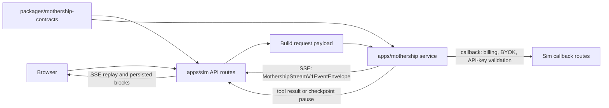
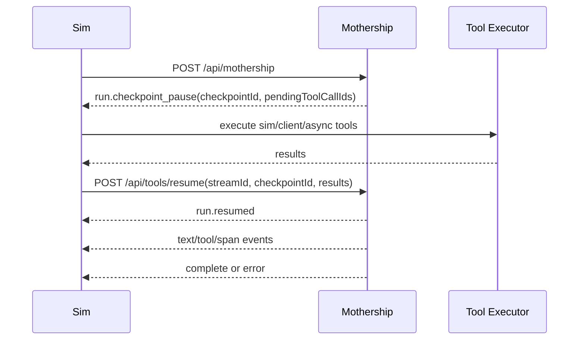

# Owned Mothership Backend Replacement Architecture

Date: 2026-06-22

Status: Phase 1 architecture baseline approved at G0. Runtime implementation is governed by the execution plan and coverage audit; this document is now the contract reference, not the active approval gate.

## Decision

Build an owned, dedicated `apps/mothership` service inside this monorepo, with shared protocol packages under `packages/*`.

Do not rebuild Mothership as hidden logic inside `apps/sim`. The service boundary is part of the product: Sim sends workspace context and user intent to a backend orchestrator, the backend streams protocol events back, and the backend calls Sim through narrow callback routes for billing, entitlement, BYOK, and durable tool-result handoff.

Recommended first owned implementation language: TypeScript on Bun. The original hosted backend appears to be a separate Go service from source comments, trace names, and route naming, but the private backend source is not present in this repo. Rebuilding in TypeScript keeps the owned service aligned with existing contracts, generated tool catalog, package boundaries, Bun workspace tooling, and test infrastructure. The service must still be a real process boundary.

The process boundary does not create competing product-domain ownership. Per
[ADR 0004](../../../apps/sim/docs/architecture/adr/0004-control-surfaces-project-canonical-domain-state.md),
Task owns outcome and coordination, Artifact owns versioned work, and Execution owns the durable
user-visible attempt. Mothership owns the private runtime mechanics that implement and resume an
Execution.

## Non-Negotiables

1. No normal runtime dependency on `copilot.sim.ai` or `www.copilot.sim.ai`.
2. No required dependency on `/Users/kyin/Projects/copilot`.
3. No `apps/mothership` imports from `apps/sim`.
4. Shared wire contracts live in packages, not inside one app's private tree.
5. Stream protocol compatibility is a hard gate, not best effort.
6. Secret direction and capability must be explicit. See [Mothership secret boundary lessons](mothership-secret-boundaries.md).
7. Public workflow API keys must never authenticate service-to-service routes.
8. The implementation is accepted only after golden stream tests, wrong-key auth tests, callback tests, and rollout checks pass.

## Current Evidence

| Area | Evidence path |
| --- | --- |
| Runtime stream loop and resume behavior | `apps/sim/lib/copilot/request/lifecycle/run.ts` |
| SSE parsing, terminal-event requirement, subagent routing | `apps/sim/lib/copilot/request/go/stream.ts` |
| Chat payload shape | `apps/sim/lib/copilot/chat/payload.ts` |
| Generated stream envelope and event union | `apps/sim/lib/copilot/generated/mothership-stream-v1.ts` |
| Owned source contracts already seeded | `packages/mothership-contracts/contracts/` |
| Runtime URL and hosted fallback removal | `apps/sim/lib/copilot/constants.ts`, `apps/sim/lib/copilot/server/agent-url.ts` |
| Callback auth helper | `apps/sim/lib/copilot/request/http.ts` |
| Billing callback | `apps/sim/app/api/billing/update-cost/route.ts` |
| BYOK callback | `apps/sim/app/api/copilot/byok/validate/route.ts` |
| API-key entitlement callback | `apps/sim/app/api/copilot/api-keys/validate/route.ts` |
| Product Mothership scope | `apps/docs/content/docs/en/mothership/*.mdx` |

## Reverse-Engineered Boundary

Sim currently calls a backend through these backend-facing routes:

| Sim caller | Backend route | Purpose |
| --- | --- | --- |
| Copilot chat | `POST /api/copilot` | Single-workflow Copilot stream |
| Mothership chat | `POST /api/mothership` | Workspace-level Mothership stream |
| Tool continuation | `POST /api/tools/resume` | Continue after async/client/sim tool checkpoint |
| Model list | `GET /api/get-available-models` | Fetch backend model options |
| API key list/delete/generate | `/api/validate-key/*` | Backend-managed API keys |
| Explicit abort | `POST /api/streams/explicit-abort` | Stop active backend stream |
| Chat fork | `POST /api/chats/fork` | Best-effort copy of backend chat state |
| BYOK admin | `/api/admin/byok` | Admin BYOK management |

The owned service must support the same route contract or Sim must migrate through an explicit compatibility adapter.

## Request Payload Contract

The chat request payload includes:

| Field group | Examples |
| --- | --- |
| User input | `message`, `messageId`, `chatId` |
| Scope | `userId`, `workspaceId`, `workflowId`, `workflowName` |
| Model selection | `model`, `provider`, `mode` |
| Context | `context`, uploaded file tags, `workspaceContext`, `commands` |
| Tool surfaces | `integrationTools`, `mothershipTools` |
| User metadata | `userPermission`, `userTimezone`, `userMetadata` |
| Runtime switches | `prefetch`, `implicitFeedback`, `docCompiler`, `isHosted` |

The replacement service must treat these as a wire contract, not as incidental JSON. Request validation should live in `packages/mothership-contracts` so Sim and Mothership use the same schemas.

## Stream Contract

Every backend stream event must conform to `MothershipStreamV1EventEnvelope`.

Required envelope fields:

| Field | Requirement |
| --- | --- |
| `v` | Must be `1`. |
| `type` | One of `session`, `text`, `tool`, `span`, `resource`, `run`, `error`, `complete`. |
| `seq` | Monotonic per stream. |
| `ts` | ISO timestamp. |
| `stream.streamId` | Stable stream id. For current Sim this is tied to the message id. |
| `trace.requestId` | Required when tracing is available. |
| `scope` | Required for subagent lane routing. |

Supported event families:

| Event family | Required behavior |
| --- | --- |
| `session.chat` | Establish or confirm `chatId`. |
| `text` | Stream assistant and thinking text. Main and subagent lanes are handled differently. |
| `tool.call` | Register tool call and route execution. |
| `tool.args_delta` | Parsed by contract. Current Sim does not persist it. |
| `tool.result` | Record terminal tool output, error, status, and timestamps. |
| `span` | Drive subagent lifecycle and structured trace blocks. |
| `resource` | Reserved for resource upsert/remove. Current Sim handler is mostly no-op. |
| `run.checkpoint_pause` | Pause stream and wait for async/client/sim tool results. |
| `run.resumed` | Clear pause state and continue. |
| `run.compaction_start` and `run.compaction_done` | Represent context compaction as synthetic tool blocks. |
| `error` | Terminal error path. |
| `complete` | Terminal success or cancellation path with usage and cost. |

Terminal rule: every stream must end with `complete` or `error`, unless Sim already observed an abort. If the response body closes without a terminal event, Sim treats it as backend failure.

## Checkpoint And Resume

Resume requirements:

1. Resume payload contains `streamId`, `checkpointId`, `userId`, optional `workspaceId`, and `results`.
2. A retryable resume stream error can retry up to the current Sim limit.
3. Retried resume legs may include `willRetryOnStreamError`.
4. Billing callbacks must be cumulative and monotonic so retry legs do not double-charge.
5. Checkpoints must be durable enough to survive process restarts and deploys.

## Tool Execution Model

The tool catalog already encodes routes such as `go`, `sim`, `client`, and `subagent`. In the owned service:

| Route target | Owned meaning |
| --- | --- |
| `go` | Mothership executes directly. The route name should eventually become neutral, but contract compatibility can preserve the value. |
| `sim` | Mothership emits checkpoint/tool call and Sim executes server-side tool logic. |
| `client` | Browser executes or confirms through the existing client-executable flow. |
| `subagent` | Mothership delegates internally and emits scoped span/text/tool events. |

Do not fake unsupported tools as success. Unsupported tools must fail with typed tool errors that stream through the contract and preserve trace ids.

## State Ownership

| State | Owner | Notes |
| --- | --- | --- |
| Canonical Task, Artifact, and Execution state | Owning Sim domain context | Mothership uses explicit contracts and correlation ids; process ownership does not create a second product system of record. |
| Workspace database, workflows, tables, files, knowledge bases, credentials | Sim | Mothership reads through payload, callbacks, or explicit Sim-side tools. |
| Chat rows and visible messages | Sim | Backend can keep orchestration state, but Sim owns user-visible chat persistence. |
| Stream run state | Mothership runtime | Includes stream id, seq, terminal state, provider response ids, and abort state; it is correlated to the canonical Execution. |
| Checkpoints | Mothership runtime | Durable, idempotent continuation state within one canonical Execution. |
| Tool calls and pending results | Both | Mothership orchestrates; Sim persists visible blocks and executes Sim/client tools. |
| Billing usage ledger | Sim authoritative | Mothership reports cumulative usage through callback. |
| BYOK entitlement | Sim authoritative | Mothership asks Sim before using workspace BYOK. |
| Admin/BYOK config | Mothership service plus Sim admin proxy | Admin auth is separate from runtime auth. |

## Canonical Execution Correlation

The owned runtime must retain both canonical and runtime identities:

1. `executionId` identifies the durable product attempt and is distinct from Mothership run, stream,
   checkpoint, provider-response, and tool-call ids.
2. One Execution may include multiple checkpoint and resume stream legs.
3. An explicit retry creates a new Execution linked to the prior Execution; reconnect or resume does not.
4. Workflow execution resolves an exact Artifact Version or explicitly authorized Draft before the
   attempt becomes canonical.
5. Durable run events and checkpoints are authoritative for replay. Redis and browser state are delivery
   caches or projections, not the only execution record.

Phase 4 of the Sim architecture roadmap owns the compatibility slice that adapts current run persistence
to this model. This architecture document does not claim that the correlation is already complete.

## Auth Boundary

The replacement must use distinct secret domains:

| Direction | Header | Env |
| --- | --- | --- |
| Sim to Mothership runtime | `X-Mothership-Runtime-Key` | `SIM_TO_MOTHERSHIP_API_KEY` |
| Mothership to Sim callbacks | `X-Sim-Callback-Key` | `MOTHERSHIP_TO_SIM_CALLBACK_KEY` |
| Sim admin proxy to Mothership admin | `X-Mothership-Admin-Key` | `MOTHERSHIP_ADMIN_API_KEY` |

Startup must reject missing production secrets, equal secrets, known demo secrets outside tests, and legacy aliases that silently override explicit new vars.

Wrong-family valid keys must fail with 403. Missing or unknown keys must fail with 401.

## Observability

Required trace/log shape:

| Area | Required fields |
| --- | --- |
| Request | `requestId`, `traceparent`, route, method, user id hash, workspace id hash |
| Stream | stream id, seq, event type, first event latency, terminal event, close reason |
| Resume | checkpoint id, attempt number, pending tool ids, retry reason |
| Tool | tool id, call id, route target, executor, status, latency, error code |
| Auth | route family, header family, outcome, key fingerprint |
| Billing | model, cumulative tokens, cumulative cost, billing callback result |

Alert candidates:

1. Stream closed without terminal event.
2. Resume retries exhausted.
3. Wrong-family service-auth attempts.
4. Callback 401/403 from Sim.
5. Billing callback failures or non-monotonic usage.
6. Checkpoints older than a threshold without resume.
7. Admin route attempts with runtime credentials.

## Phase 2 Implementation Plan

### 1. Shared Contract Packages

Create:

| Package | Purpose |
| --- | --- |
| `packages/mothership-contracts` | JSON schemas, generated TS types, request/response contracts, stream fixtures. |
| `packages/mothership-client` | Sim-side typed client for runtime, admin, callback helpers, and stream parser wrappers if useful. |

Keep owned contract source under `packages/mothership-contracts/contracts/`. Generated Sim files can remain under `apps/sim/lib/copilot/generated/` as consumers until migrated.

Verification:

1. `bun run mship:check`
2. All individual contract check scripts.
3. Monorepo boundary check proves packages do not import from apps.

### 2. Dedicated Service Skeleton

Create `apps/mothership` as a Bun service with:

1. Health and readiness endpoints.
2. Structured logger using `@sim/logger`.
3. Env loader and startup secret guard.
4. Route-family auth middleware.
5. OTel/request id propagation.
6. SSE writer that emits only contract-valid envelopes.
7. Graceful shutdown that rejects new streams and drains active streams.

Verification:

1. Unit tests for env guard.
2. Unit tests for auth matrix.
3. Health/readiness route tests.
4. Boundary check.

### 3. Protocol-Complete Runtime Routes

Implement route surfaces:

| Route | Acceptance |
| --- | --- |
| `POST /api/mothership` | Emits valid stream, supports session/chat/text/tool/span/run/error/complete. |
| `POST /api/copilot` | Same stream contract, single-workflow scope. |
| `POST /api/tools/resume` | Resumes from durable checkpoint and preserves seq/trace continuity. |
| `POST /api/streams/explicit-abort` | Marks stream aborted and stops generation/tool dispatch. |
| `GET /api/get-available-models` | Returns typed model list. |
| `/api/validate-key/*` | Replaces current backend key-management surface or explicitly migrates it. |
| `/api/admin/byok` | Admin-only BYOK management. |
| `POST /api/chats/fork` | Copies backend orchestration state or returns typed no-op if state is fully Sim-owned. |

This is protocol-complete work. Product breadth can be staged only if unsupported operations fail explicitly through the protocol and do not pretend to work.

Verification:

1. Golden SSE fixture replay tests.
2. Invalid envelope rejection tests.
3. Missing-terminal stream failure test.
4. Abort test.
5. Resume retry test.

### 4. State And Persistence

Add durable tables or storage for:

1. Mothership runs.
2. Stream sessions.
3. Event sequence cursor.
4. Checkpoints.
5. Tool call ledger.
6. Abort markers.
7. Provider response ids and usage snapshots.
8. Idempotency keys for callbacks and resume.

Use `packages/db` migrations if the state belongs in the shared Postgres database. Keep Mothership-specific persistence behind a package boundary so Sim does not reach into internal runtime tables casually.

Verification:

1. Migration safety check.
2. Repository unit tests.
3. Restart/resume test.
4. Idempotent callback test.

### 5. Callback Client

Mothership must call Sim through typed callback clients for:

1. `/api/copilot/api-keys/validate`
2. `/api/copilot/byok/validate`
3. `/api/billing/update-cost`
4. any explicit tool-result confirmation path needed by client/sim tools

Verification:

1. Callback contract tests.
2. 401/403 fail-closed tests.
3. Billing monotonicity tests.
4. Trace propagation tests.

### 6. Tool And Subagent Kernel

Implement the orchestration kernel with:

1. Tool route planner using the generated catalog.
2. Provider adapter layer.
3. Sim tool checkpoint dispatcher.
4. Client tool checkpoint dispatcher.
5. Subagent runner that emits scoped span/text/tool events.
6. Resource event emitter for workspace files/tables/workflows where applicable.
7. Typed failure taxonomy.

Verification:

1. Tool route tests for `go`, `sim`, `client`, and `subagent`.
2. Subagent event ordering tests.
3. Unsupported-tool typed error tests.
4. Long-running task timeout and cancellation tests.

### 7. Deployment And Rollout

Add:

1. `apps/mothership/package.json`.
2. Docker service.
3. Helm templates or documented local compose wiring.
4. Dev script integration, likely `dev:full:mothership`.
5. Env docs with no committed secrets.
6. Migration mode that uses owned service only.

Verification:

1. Local boot smoke.
2. Sim chat route points at owned service.
3. `rg` proves no runtime fallback to hosted `copilot.sim.ai`.
4. Full targeted gate: contract checks, type-check, lint/format, API validation, boundaries, tests.

## Phase 3 Product-Vision Hardening

Phase 3 is the product-complete Mothership control plane, not a demo.

| Capability | Required backend support |
| --- | --- |
| Workspace-wide context | Snapshot ingestion, selective retrieval, stale-context detection, permission filtering. |
| Workflows | Create, edit, run, debug, deploy, rollback, organize folders, set variables. |
| Research | Live web search/read/crawl with citation and saved-report output. |
| Files | Upload/read/create/edit documents, markdown, CSV, JSON, images, charts, PPTX. |
| Tables | Create/query/update/export workspace tables with typed result previews. |
| Knowledge bases | Create, populate, query, attach to workflows, inspect status. |
| Automation and tasks | Scheduled Mothership jobs with logs, retries, pause/resume, and direct actions. |
| Integrations and credentials | Credential discovery, setup flows, direct actions, MCP/custom tool management. |
| Subagents | Build, research, file, action, debug, integration, and table subagents with visible lifecycle spans. |
| Admin and BYOK | Admin dashboards, BYOK config, usage attribution, key validation, audit logs. |
| Reliability | One-hour task support, queueing, backpressure, restart-safe resume, deploy-safe draining. |

Phase 3 acceptance requires operational runbooks, dashboards, retention policies, load targets, and failure drills. It is not complete when a chat response works once.

## Compatibility Risks

| Risk | Mitigation |
| --- | --- |
| Stream drift | Golden fixtures generated from current Sim parser and generated contracts. |
| Missing terminal events | SSE writer enforces exactly one terminal event. Tests close bodies early. |
| Resume state loss | Durable checkpoints and restart/resume tests. |
| Secret confusion | Distinct headers, startup distinct-secret guard, wrong-key matrix tests. |
| Billing double-charge | Cumulative monotonic usage callback and idempotency keys. |
| BYOK misuse | Sim authoritative entitlement callback before key use. |
| Tool route mismatch | Generated catalog contract and route-target tests. |
| Subagent UI breakage | Scoped span fixtures with parentToolCallId/spanId ordering. |
| App boundary erosion | Boundary check and package ownership rules. |
| Hosted fallback regression | CI search for hosted URLs in runtime path. |

## Approval Gate

G0 approved this direction before implementation:

1. Dedicated `apps/mothership` service inside the monorepo.
2. Shared packages for contracts and client helpers.
3. TypeScript/Bun first implementation, preserving service boundary.
4. Distinct service-auth headers and env names.
5. Protocol-complete stream/resume/auth/callback baseline before product breadth.
6. Phase 3 product-complete hardening as the target vision.

If any of these become wrong, the implementation plan and coverage audit must be changed before further code proceeds.
