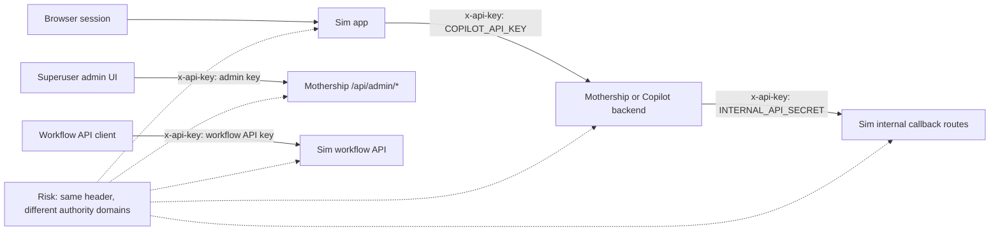
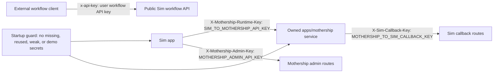
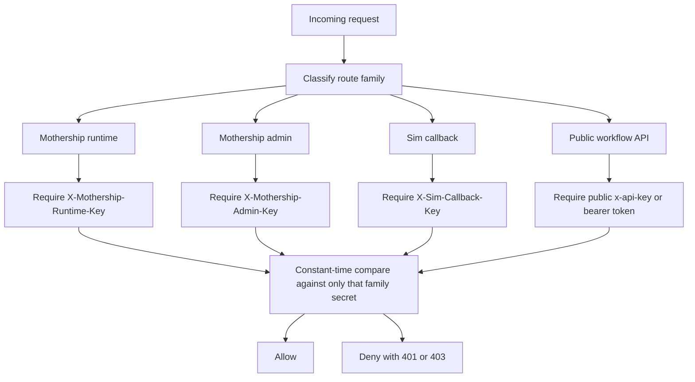

# Mothership Secret Boundary Lessons

Date: 2026-06-22

Status: Phase 1 security architecture note and canonical auth-boundary reference for implemented owned Mothership runtime/auth code paths.

## Purpose

This document captures a specific lesson from the original Sim-to-Mothership integration shape: generic shared-secret wiring is easy to misconfigure when several different trust relationships reuse the same `x-api-key` header.

This is not a finding that the hosted Sim.ai backend is currently exploitable. It is a concrete design risk in the integration shape. The owned replacement must make the wrong configuration impossible to boot, not merely documented as bad.

## Legacy Evidence

The original repo shape used different environment variables for different directions, but sent or received them through the same header name. The owned replacement must not preserve this shape for callback routes.

| Trust relationship | Current variable | Current header | Evidence |
| --- | --- | --- | --- |
| Sim calls Mothership runtime chat/resume/abort/model/key APIs | `COPILOT_API_KEY` | `x-api-key` | `apps/sim/lib/copilot/request/lifecycle/run.ts` |
| Mothership calls Sim internal callback routes | `INTERNAL_API_SECRET` | `x-api-key` | legacy callback shape, now replaced by strict `x-sim-callback-key` callback auth |
| Sim admin UI proxies to Mothership admin routes | admin key resolved by route | `x-api-key` | `apps/sim/app/api/admin/mothership/route.ts` |
| Public workflow API clients call Sim | user workflow API key | `x-api-key` | `apps/sim/app/api/workflows/middleware.ts` |

The problem is not that `x-api-key` exists. The problem is that one wire-level header carries multiple unrelated permissions, so a future operator or code path can paste the right-looking secret into the wrong trust domain.

## Legacy Shape



## Why This Is Easy To Misconfigure

The names and headers do not encode direction or capability strongly enough.

| Current concept | Why it is ambiguous |
| --- | --- |
| `COPILOT_API_KEY` | Sounds like a generic key for all Copilot/Mothership access, but it should only authenticate Sim to the backend runtime service. |
| `INTERNAL_API_SECRET` | Sounds broadly internal, and is used by many Sim-internal paths. A backend callback secret should not inherit unrelated internal authority. |
| `x-api-key` | Also used by public API clients, tool providers, Mothership runtime calls, Mothership callbacks, and admin proxy calls. Logs and examples can hide which authority is actually being exercised. |
| Optional runtime key | If the service accepts unauthenticated calls in one environment, accidental permissive config can survive until production. |

## Bad Examples And Outcomes

These use fake values. They describe what can happen if a replacement repeats the same shape.

### Example 1: Runtime key equals callback key

```env
COPILOT_API_KEY=shared_secret_prod_123
INTERNAL_API_SECRET=shared_secret_prod_123
```

What happens:

1. Sim can call Mothership runtime endpoints.
2. Mothership can call Sim callback endpoints.
3. Any leak of the runtime key is also a leak of the callback key.

Why this is bad:

The blast radius crosses directions. A credential intended for outbound Sim-to-Mothership traffic can now authorize inbound calls to billing, BYOK, API-key validation, or other internal callback routes.

Correct behavior:

The app must refuse to start when the runtime key and callback key are equal.

### Example 2: Operator pastes Sim internal secret into backend runtime config

```env
SIM_SIDE:
  INTERNAL_API_SECRET=sim_internal_callback_secret
  COPILOT_API_KEY=runtime_secret_expected_by_mothership

MOTHERSHIP_SIDE:
  SIM_TO_MOTHERSHIP_API_KEY=sim_internal_callback_secret
```

What happens:

1. Chat may appear to work if Sim sends the same value Mothership expects.
2. The Mothership service now stores or knows a secret that also unlocks Sim internal callback routes.

Why this is bad:

A backend runtime service should not need Sim's callback secret. The callback secret is authority to call back into Sim, not authority to receive chat requests.

Correct behavior:

Mothership should only accept `X-Mothership-Runtime-Key`. Sim callback routes should only accept `X-Sim-Callback-Key`. The two values must be different and should never be stored in the same env slot.

### Example 3: Admin key reused as runtime key

```env
SIM_TO_MOTHERSHIP_API_KEY=admin_secret_prod_123
MOTHERSHIP_ADMIN_API_KEY=admin_secret_prod_123
```

What happens:

1. Normal chat traffic succeeds.
2. A runtime credential leak also grants access to admin routes.

Why this is bad:

Runtime traffic is high volume and higher exposure. Admin authority must have a smaller exposure surface and must never be accepted by runtime route middleware.

Correct behavior:

Runtime routes reject admin keys with 403. Admin routes reject runtime keys with 403. Startup rejects equal secret fingerprints.

### Example 4: Public workflow API key accepted by internal middleware

```http
POST /api/billing/update-cost
x-api-key: user_workflow_api_key
```

What happens in the fixed design:

The route returns 401 or 403 because public user API keys are not callback keys.

What must never happen:

An internal callback route must not fall through to generic API-key auth and treat a user's workflow API key as internal service authority.

Correct behavior:

Internal callback routes use only callback auth middleware. Public API-key auth stays isolated to public workflow API routes.

### Example 5: Missing key treated as development convenience

```env
SIM_TO_MOTHERSHIP_API_KEY=
```

What happens in the fixed design:

Production boot fails. Development boot fails unless an explicit local-only bypass flag is set.

What must never happen:

The backend should not silently accept missing runtime auth because a local environment happened to work.

Correct behavior:

Every route family has an explicit auth mode. The default is fail closed.

## Required Fixed Shape



## Required Secret Names

The replacement should use names that encode direction and capability.

| New variable | Owner | Sent by | Accepted by | Scope |
| --- | --- | --- | --- | --- |
| `SIM_TO_MOTHERSHIP_API_KEY` | Sim deployment | Sim | Mothership runtime routes | Chat, resume, abort, model list, runtime key management if allowed |
| `MOTHERSHIP_TO_SIM_CALLBACK_KEY` | Sim deployment, also configured in Mothership | Mothership | Sim callback routes | Billing updates, BYOK validation, API-key validation, other callback-only routes |
| `MOTHERSHIP_ADMIN_API_KEY` | Mothership deployment | Sim admin proxy or ops tooling | Mothership admin routes | Admin inspection, BYOK administration, maintenance endpoints |
| public workflow API keys | Sim users/workspaces | external clients | public workflow API routes | Workflow execution only |

Migration aliases can exist temporarily, but aliases must be one-way and noisy:

| Legacy variable | Temporary mapping | Required warning |
| --- | --- | --- |
| `COPILOT_API_KEY` | `SIM_TO_MOTHERSHIP_API_KEY` | Warn that `COPILOT_API_KEY` is deprecated and runtime-only. |
| `INTERNAL_API_SECRET` | no direct replacement for Mothership callbacks | Do not silently reuse it as `MOTHERSHIP_TO_SIM_CALLBACK_KEY`. Require explicit callback key config. |

## Required Header Names

| Header | Accepted only on | Rejected on |
| --- | --- | --- |
| `X-Mothership-Runtime-Key` | Mothership runtime routes | Sim callbacks, Mothership admin routes, public workflow routes |
| `X-Sim-Callback-Key` | Sim callback routes | Mothership runtime routes, Mothership admin routes, public workflow routes |
| `X-Mothership-Admin-Key` | Mothership admin routes | Mothership runtime routes, Sim callback routes, public workflow routes |
| `x-api-key` | Public workflow API routes and third-party provider calls where already established | Mothership service-to-service routes in the owned replacement |

## Route Family Auth Matrix

| Route family | Examples | Required auth | Wrong-key behavior |
| --- | --- | --- | --- |
| Mothership runtime | `POST /api/mothership`, `POST /api/copilot`, `POST /api/tools/resume`, `POST /api/streams/explicit-abort` | `X-Mothership-Runtime-Key` | 403 if callback/admin key; 401 if missing or unknown |
| Mothership admin | `/api/admin/*` | `X-Mothership-Admin-Key` | 403 if runtime/callback key; 401 if missing or unknown |
| Sim callbacks | `/api/billing/update-cost`, `/api/copilot/api-keys/validate`, `/api/copilot/byok/validate` | `X-Sim-Callback-Key` | 403 if runtime/admin/user key; 401 if missing or unknown |
| Public workflow API | `/api/workflows/*` public execution paths | public workflow API key or bearer token | 403 if service key; 401 if missing or unknown |

## Startup Guardrails

Both Sim and Mothership must validate secret topology on boot.

Required checks:

1. Required production secrets are present.
2. Required secrets meet minimum entropy and length.
3. No two service secrets are equal.
4. No service secret matches known dev/demo/test strings outside test mode.
5. Legacy aliases cannot override explicit new variables.
6. Legacy aliases emit deprecation warnings with secret fingerprints only.
7. Logs never print raw secret values.

Example fixed startup check:

```ts
const secrets = [
  ['SIM_TO_MOTHERSHIP_API_KEY', env.SIM_TO_MOTHERSHIP_API_KEY],
  ['MOTHERSHIP_TO_SIM_CALLBACK_KEY', env.MOTHERSHIP_TO_SIM_CALLBACK_KEY],
  ['MOTHERSHIP_ADMIN_API_KEY', env.MOTHERSHIP_ADMIN_API_KEY],
] as const

for (const [name, value] of secrets) {
  assertRequiredSecret(name, value)
}

assertDistinctSecrets(secrets)
```

The implementation should live in a shared package or duplicated small helper with tests. Do not hide this in route-local code.

## Runtime Guardrails

Auth middleware should identify the route family before comparing secrets.



Rules:

1. Missing key means 401.
2. Unknown key means 401.
3. Known key for the wrong route family means 403.
4. Failed auth logs route family, key fingerprint, and reason.
5. Failed auth never logs raw key material.

## Observability Requirements

Every service-auth decision should emit structured fields:

| Field | Example |
| --- | --- |
| `auth.route_family` | `sim_callback` |
| `auth.header_family` | `mothership_runtime` |
| `auth.outcome` | `wrong_family` |
| `auth.key_fingerprint` | `sha256:abcd1234` |
| `http.route` | `/api/billing/update-cost` |
| `trace.request_id` | existing request ID |

Alert candidates:

1. Any `wrong_family` auth result in production.
2. Any missing service key on service-to-service routes.
3. Any callback route called from an unexpected network segment, if network metadata is available.
4. Any admin route attempt using runtime credentials.

## Test Plan

Minimum tests for the owned replacement:

| Test | Expected result |
| --- | --- |
| Runtime route with runtime key | 200 or route-specific success path |
| Runtime route with callback key | 403 |
| Runtime route with admin key | 403 |
| Runtime route with public workflow key | 403 |
| Callback route with callback key | 200 or route-specific success path |
| Callback route with runtime key | 403 |
| Callback route with admin key | 403 |
| Callback route with public workflow key | 403 |
| Admin route with admin key | 200 or route-specific success path |
| Admin route with runtime key | 403 |
| Startup with equal runtime and callback secrets | boot failure |
| Startup with equal runtime and admin secrets | boot failure |
| Startup with missing production callback secret | boot failure |
| Production startup with known demo secret | boot failure |

## Migration Plan

1. Add new env names and headers to Sim behind compatibility adapters.
2. Add Mothership service middleware that accepts only the new headers.
3. Temporarily allow `COPILOT_API_KEY` as an alias for `SIM_TO_MOTHERSHIP_API_KEY`.
4. Keep `MOTHERSHIP_RUNTIME_HEADER_MODE=legacy` only for pre-strict Copilot backends; use `strict` for owned `apps/mothership` routes.
5. Do not alias `INTERNAL_API_SECRET` to `MOTHERSHIP_TO_SIM_CALLBACK_KEY`.
6. Update callback routes to require `X-Sim-Callback-Key`.
7. Update admin proxy routes to use `X-Mothership-Admin-Key`.
8. Add startup distinct-secret checks to both apps.
9. Add negative auth matrix tests.
10. Remove legacy alias/header support after migration.

## Acceptance Criteria

The Mothership replacement is not accepted until:

1. No service-to-service owned route uses generic `x-api-key`.
2. Each route family has exactly one accepted service-auth header.
3. Equal service secrets fail startup.
4. Wrong-family valid secrets fail without granting access. Public responses must not prove that a secret is valid in another family.
5. Missing or unknown service secrets fail with 401.
6. Public workflow API keys cannot authenticate service-to-service routes.
7. Logs and traces identify route family and auth result without exposing raw secrets.
8. Tests cover every route family and wrong-key direction.
