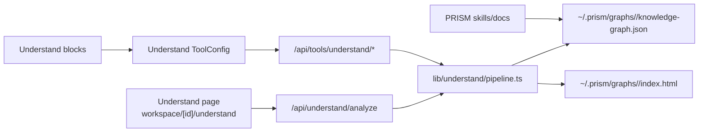

# Understand + PRISM Integration Handoff

Last verified locally: 2026-06-16 18:43 PDT.

## Purpose

This document records the Sim Studio + Understand + PRISM work that was
implemented after the prior ZCode session hit quota. It is meant to be the
handoff source of truth: what works, what changed, what was considered, why the
current design was chosen, how it was verified, and what remains.

## Current Status

The local Sim app runs on:

```text
http://localhost:6888
```

The Understand page is available at:

```text
http://localhost:6888/workspace/<workspaceId>/understand
```

The page and API can scan a local codebase, parse source structure, extract
deterministic summaries/relationships, build a PRISM-compatible graph JSON, and
render a standalone HTML report.

## Implemented Scope

### Sim Local Plumbing

Changed the local development app port from `3000` to `6888` for the host-local
Sim instance:

- `apps/sim/package.json`
  - `dev`
  - `dev:capped`
  - `load:workflow:*` default `BASE_URL`
- `apps/sim/.env`
  - `BETTER_AUTH_URL`
  - `NEXT_PUBLIC_APP_URL`
- `apps/sim/.env.example`
- `bunfig.toml`
- `apps/sim/next.config.ts`
- `apps/sim/lib/core/utils/urls.ts`
- `apps/sim/scripts/load/README.md`

Why: port `3000` is a common collision point on this machine. Moving the local
Sim app to `6888` makes the active host setup explicit and avoids fighting other
dev servers. Docker, Helm, and generic test fixtures still use `3000` where it
is a container/default example rather than the active local host port.

### Understand Pipeline Core

Added the pipeline implementation in:

```text
apps/sim/lib/understand/pipeline.ts
```

The pipeline stages are:

| Stage | Function | Output |
|---|---|---|
| Scan | `scanCodebase` | files, languages, sizes, line counts |
| Parse | `parseCodebase` | imports, functions, classes, calls |
| Extract | `extractCodeSemantics` | file summaries and relationships |
| Graph | `buildKnowledgeGraph` | PRISM-compatible graph JSON |
| View | `renderKnowledgeGraph` | standalone HTML report |

Why: the first implementation needs to be deterministic and usable without API
keys, model availability, queues, or billing. This creates a stable baseline
before adding LLM-enriched semantic extraction.

### Tool Types and Sim Tools

Added shared types and five tool definitions:

```text
apps/sim/tools/understand/types.ts
apps/sim/tools/understand/scan/execute.ts
apps/sim/tools/understand/parse/execute.ts
apps/sim/tools/understand/extract/execute.ts
apps/sim/tools/understand/graph/execute.ts
apps/sim/tools/understand/view/execute.ts
apps/sim/tools/understand/index.ts
```

Registered tools in:

```text
apps/sim/tools/registry.ts
```

Why: Sim workflows call tools through `ToolConfig`. The tool configs must stay
client-safe, so they call API routes instead of importing the server pipeline.

### API Contracts and Routes

Added API contracts:

```text
apps/sim/lib/api/contracts/understand.ts
apps/sim/lib/api/contracts/tools/understand.ts
```

Added routes:

```text
apps/sim/app/api/understand/analyze/route.ts
apps/sim/app/api/tools/understand/scan/route.ts
apps/sim/app/api/tools/understand/parse/route.ts
apps/sim/app/api/tools/understand/extract/route.ts
apps/sim/app/api/tools/understand/graph/route.ts
apps/sim/app/api/tools/understand/view/route.ts
```

Why: Sim has a contract-first boundary pattern. Routes should not define local
boundary schemas or parse raw JSON ad hoc. The first tool route version was
reviewed and corrected to use `parseToolRequest` and shared route contracts.

### Sim Blocks

Added five workflow blocks:

```text
apps/sim/blocks/blocks/understand_scan.ts
apps/sim/blocks/blocks/understand_parse.ts
apps/sim/blocks/blocks/understand_extract.ts
apps/sim/blocks/blocks/understand_graph.ts
apps/sim/blocks/blocks/understand_view.ts
```

Registered blocks in:

```text
apps/sim/blocks/registry.ts
```

Why: the user asked for Understand-Anything as native Sim blocks, not only a
custom script. Blocks make the pipeline available to the workflow builder and
align with Sim's existing tool/block architecture.

### One-Click Understand Page

Added:

```text
apps/sim/app/workspace/[workspaceId]/understand/page.tsx
apps/sim/app/workspace/[workspaceId]/understand/understand.tsx
```

Added a sidebar entry in:

```text
apps/sim/app/workspace/[workspaceId]/w/components/sidebar/sidebar.tsx
```

Why: block-by-block workflow use is useful, but the user also wanted a direct
code-understanding page. The page provides a single click path for local
analysis and artifact generation.

### PRISM Integration

Updated the local PRISM plugin under:

```text
/Users/kyin/.zcode/cli/plugins/cache/zcode-plugins-official/prism/1.0.0
```

Changed or added:

```text
skills/prism/SKILL.md
skills/sim/SKILL.md
skills/understand/SKILL.md
docs/SIM-INTEGRATION.md
format/spec.md
README.md
ARCHITECTURE.md
registry.json
index.md
log.md
```

Why: PRISM needed to know about three new operational branches:

- `/prism sim`
- `/prism understand <path>`
- `/prism graph <project>`

The plugin docs also needed graph format notes so generated code graphs can be
mapped into PRISM's typed-edge vocabulary.

### PRISM Linter Patch

Patched:

```text
skills/lint/scripts/lint.py
```

The linter now ignores wikilinks inside fenced code blocks.

Why: code examples such as `[[target|edge-type]]` are documentation examples,
not real graph edges. Treating them as real links caused false broken-link and
typed-edge failures.

## Architecture



## Decisions and Rationale

### Server Pipeline, Client-Safe Tools

The pipeline imports `node:fs/promises`, `node:path`, and `typescript`. It must
not be bundled into client surfaces. Tool configs therefore use HTTP route calls,
and only API routes import the pipeline.

This fixed the observed client-bundle failure where the workspace page attempted
to resolve `node:fs/promises`.

### Deterministic Extract First

`understand_extract` currently derives summaries and relationships from parsed
code structure. It does not call an LLM.

Why:

- deterministic output is easier to verify
- no API keys or model routing are required
- the graph can be generated offline
- it creates a baseline for future LLM enrichment

Future LLM extraction should be additive, not a replacement for deterministic
structure.

### TypeScript Compiler API for TS/JS

TypeScript and JavaScript files are parsed with the TypeScript compiler API.
Other supported languages use lightweight regex extraction.

Why: the Sim app is TypeScript-heavy, so TS/JS correctness matters most for the
initial slice. Regex fallback gives useful coverage for Python, Go, Rust, Java,
and other common files without taking on tree-sitter dependencies yet.

### Relationship De-Duplication

`buildKnowledgeGraph` derives `defines`, `imports`, `calls`, `extends`, and
`implements` from parsed data. It skips duplicate extracted relationships of
those same types when parsed data is present.

Why: the earlier build double-counted graph edges because extract emitted
relationships and graph build independently derived the same relationships.

### 6888 for Host-Local Sim Only

Host-local Sim now uses `6888`. Docker, Helm, self-hosting docs, and many test
fixtures still mention `3000`.

Why: those references are either container-local defaults, upstream docs, or
inert test URLs. Changing them all would be broader than the local plumbing
request and could break expectations outside this machine.

### PRISM Graph Edge Mapping

Generated graph edges remain code-native:

| Graph edge | PRISM edge | Why |
|---|---|---|
| `imports` | `depends-on` | source depends on imported file or module |
| `calls` | `supports` | caller reaches/uses callee |
| `defines` | `base-of` | file contains symbol |
| `extends` | `extends` | inheritance |
| `implements` | `extends` | interface/base contract |

Why: code-native graph JSON should preserve code semantics, while PRISM import
or markdown projection can map to the broader knowledge-base vocabulary.

## Considered but Not Done

### Billing Neutralization Patches

The broad plan included deeper billing neutralization. Runtime showed
`DISABLE_AUTH=true` worked and Stripe was not blocking local Understand work.
No billing files were patched.

Why: avoid changing billing logic without a live blocker.

### Full Interactive Graph Renderer

The current graph view is a standalone HTML report with stats and tables. It is
not a force-directed canvas or D3/Cytoscape graph.

Why: the first version needed reliable artifact inspection. Interactive graph
layout is useful but should be built after graph schema and API behavior are
stable.

### Universal Port Migration

The repo still contains many `localhost:3000` references in Docker, Helm, docs,
and tests.

Why: only host-local Sim/PRISM plumbing was moved to `6888`. A universal port
migration is a separate compatibility decision.

### Tree-Sitter or Language Servers

No tree-sitter or LSP dependency was added.

Why: this would increase dependency and build complexity. The current parser is
good enough for a verified baseline and can be extended later.

### Background Jobs

The one-click analysis currently runs in the route process.

Why: this is acceptable for local `DISABLE_AUTH` usage and small/medium scans.
Production-grade analysis should move to a queue/worker with progress events.

## Verification Evidence

Latest verified checks:

```bash
curl -sS -o /tmp/sim-status-6888.html -w '%{http_code} %{size_download}\n' \
  http://localhost:6888/workspace/test/understand
# 200 211463
```

```bash
lsof -nP -iTCP:6888 -sTCP:LISTEN
# node listening on *:6888

lsof -nP -iTCP:3000 -sTCP:LISTEN
# no listener
```

```bash
curl -sS -X POST http://localhost:6888/api/understand/analyze \
  -H 'Content-Type: application/json' \
  -d '{"workspaceId":"test","rootPath":"/Users/kyin/sim/apps/sim/lib/understand","maxFiles":5,"projectName":"sim-plumbing-review"}'
# success true, files 1, functions 54, nodes 250, edges 356
```

```bash
bun --cwd apps/sim -e "import { executeTool } from './tools/index.ts'; ..."
# understand_scan success true, files 1
```

```bash
bun run --cwd apps/sim test lib/core/utils/urls.test.ts
# 1 file passed, 14 tests passed
```

```bash
bun run --cwd apps/sim lint:check
# checked 8965 files, no fixes applied
```

```bash
python3 skills/lint/scripts/lint.py \
  /Users/kyin/.zcode/cli/plugins/cache/zcode-plugins-official/prism/1.0.0
# exit 0, 0 critical, 0 warnings
```

Known global check result:

```bash
bun run --cwd apps/sim type-check
```

This still fails in pre-existing unrelated files:

- `app/api/help/route.ts`
- `lib/a2a/utils.ts`
- `lib/copilot/request/go/stream.ts`
- `lib/core/security/input-validation.server.ts`
- `lib/core/utils/browser-polyfills.ts`

No Understand or 6888 plumbing files were in the typecheck failure set.

## Generated Artifacts

The full graph artifact was generated at:

```text
/Users/kyin/.prism/graphs/sim/knowledge-graph.json
/Users/kyin/.prism/graphs/sim/index.html
```

The latest full run reported:

| Metric | Value |
|---|---:|
| Files | 500 |
| Lines | 100499 |
| Functions | 922 |
| Classes | 15 |
| Imports | 3521 |
| Calls | 25448 |
| Graph nodes | 6149 |
| Graph edges | 15577 |

Edge counts:

| Edge | Count |
|---|---:|
| `calls` | 11113 |
| `defines` | 928 |
| `extends` | 13 |
| `implements` | 2 |
| `imports` | 3521 |

## Current Risks

### Local Filesystem Access

`/api/understand/analyze` accepts a local `rootPath`. It is gated to local
development or `DISABLE_AUTH=true`, and it still requires session/internal auth.

Risk: on an untrusted network, arbitrary local path scanning would be sensitive.

Mitigation now: local/self-host gate and auth checks.

Future mitigation: root allowlist, workspace-owned path roots, audit logging,
and optional disabled-by-default feature flag.

### Large Repositories

Large scans can consume CPU and memory because analysis runs in-process.

Mitigation now: `maxFiles`, `maxFileBytes`, generated/vendor ignore patterns.

Future mitigation: background worker, cancellation, progress events, artifact
streaming, and persisted scan cache.

### Semantic Quality

The current extract stage is structural, not model-semantic.

Mitigation now: deterministic graph is correct enough for code navigation.

Future mitigation: optional LLM summaries and relationship enrichment with a
reviewable provenance field.

### Global Typecheck Debt

Full app typecheck is not green due to unrelated existing issues.

Mitigation now: focused lint/tests/runtime checks pass.

Future mitigation: fix the unrelated type failures so global CI can become a
clean gate again.

## Future Work Plan

### 1. Add Durable Tests

Add tests for:

- `scanCodebase` ignore/max-file behavior
- TS/JS parser imports, functions, methods, classes, calls
- duplicate-edge prevention
- graph output path generation
- HTML render escaping
- `/api/understand/analyze` contract behavior
- tool routes using `parseToolRequest`

Why: current proof is runtime smoke plus lint. Regression tests are needed before
this becomes durable product code.

### 2. Fix Global Typecheck

Resolve the unrelated typecheck failures listed above.

Why: the new work is clean locally, but a dirty global typecheck makes future
regressions harder to detect.

### 3. Harden Filesystem Boundaries

Add an allowlist for scan roots and record audit metadata for each analysis run.

Why: local filesystem analysis is powerful and should not become an accidental
remote file browser.

### 4. Move Long Runs to Background Execution

Run large analyses through a job queue with progress, cancellation, and artifact
links.

Why: route-process analysis is fine for local smoke and small scans but not
robust for large repositories.

### 5. Add Interactive Graph UI

Replace or augment the table HTML with an interactive graph view.

Why: stats and tables prove the artifact exists, but graph navigation needs
filtering, search, node expansion, and edge-type controls.

### 6. Add Optional LLM Enrichment

Extend `understand_extract` with optional LLM summaries and semantic
relationships. Keep deterministic extraction as the baseline.

Why: LLMs are useful for intent and architecture summaries, but structural code
facts should stay reproducible.

### 7. Package PRISM Commands into Executable Flow

The PRISM skills document `/prism sim`, `/prism understand`, and `/prism graph`
behavior. A future pass should turn that into a direct executable command layer
or script where appropriate.

Why: docs guide agents, but command automation reduces future handoff drift.

### 8. Decide Whether to Standardize Ports Globally

If this fork should always use `6888`, update Docker, Helm, self-hosting docs,
and tests intentionally in one separate port-standardization pass.

Why: those references are broader compatibility surfaces and should not be
changed incidentally as part of local host plumbing.

## Runbook

Start Sim:

```bash
cd /Users/kyin/sim/apps/sim
bun run dev
```

Verify the listener:

```bash
lsof -nP -iTCP:6888 -sTCP:LISTEN
```

Open the page:

```text
http://localhost:6888/workspace/test/understand
```

Run a smoke analysis:

```bash
curl -sS -X POST http://localhost:6888/api/understand/analyze \
  -H 'Content-Type: application/json' \
  -d '{"workspaceId":"test","rootPath":"/Users/kyin/sim/apps/sim/lib/understand","maxFiles":5,"projectName":"sim-smoke"}' \
  | jq '{success, files: .scan.stats.totalFiles, functions: (.parsed.functions|length), nodes: .graph.metadata.stats.nodes, edges: .graph.metadata.stats.edges, outputPath, htmlOutputPath}'
```

Inspect graph stats:

```bash
jq '.metadata.stats' /Users/kyin/.prism/graphs/sim/knowledge-graph.json
jq '.edges | group_by(.type) | map({type: .[0].type, count: length})' \
  /Users/kyin/.prism/graphs/sim/knowledge-graph.json
```

Run focused verification:

```bash
bun run --cwd apps/sim test lib/core/utils/urls.test.ts
bun run --cwd apps/sim lint:check
python3 /Users/kyin/.zcode/cli/plugins/cache/zcode-plugins-official/prism/1.0.0/skills/lint/scripts/lint.py \
  /Users/kyin/.zcode/cli/plugins/cache/zcode-plugins-official/prism/1.0.0
```

## Resume Checklist

1. Check `git status --short` in `/Users/kyin/sim`.
2. Check that Sim still listens on `6888`, not `3000`.
3. Run the Understand page smoke.
4. Run the API smoke.
5. Run `bun run --cwd apps/sim lint:check`.
6. Run `bun run --cwd apps/sim type-check` and confirm remaining failures are
   still unrelated or fix them.
7. Decide whether the next work is testing, graph UI, LLM enrichment, or type
   debt cleanup.
